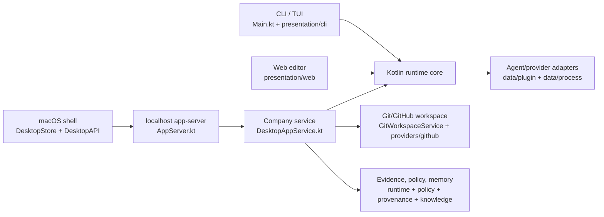
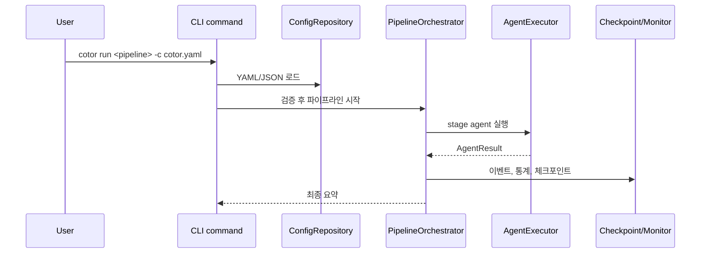
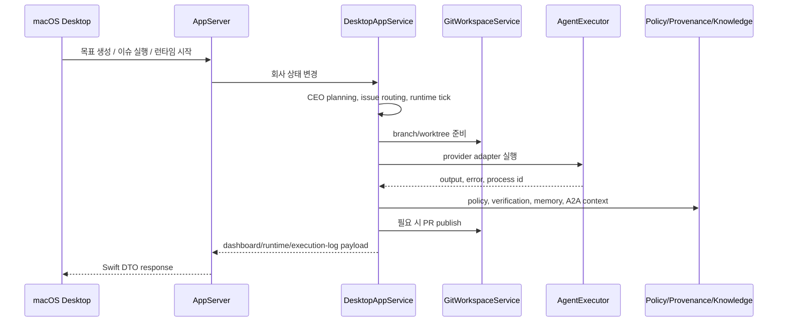

# Cotor 아키텍처

원문: [ARCHITECTURE.md](ARCHITECTURE.md)

Cotor는 로컬 우선 멀티 에이전트 런타임입니다. 하나의 Kotlin 코어가 세 사용자 표면을 구동합니다.

- CLI/TUI 명령
- localhost `app-server`
- 네이티브 macOS 데스크톱 셸

현재 데스크톱 제품 모델은 회사 중심입니다. `Company`는 목표, 이슈, 리뷰 상태, 런타임 상태, 에이전트 정의, 메모리, 로컬 증거를 소유합니다. 저장소, 워크스페이스, 태스크, 런은 회사 경계 아래의 실행 인프라입니다.

## 1. 상위 런타임

## 2. 소스 경계

| 경계 | 책임 | 주요 파일 |
| --- | --- | --- |
| CLI | 명령 파싱, interactive/TUI 실행, packaged lifecycle 명령 | `src/main/kotlin/com/cotor/Main.kt`, `src/main/kotlin/com/cotor/presentation/cli/` |
| App server | 로컬 HTTP API와 데스크톱 계약 | `src/main/kotlin/com/cotor/app/AppServer.kt`, `src/main/kotlin/com/cotor/app/DesktopModels.kt` |
| Company workflow | 회사 상태 머신, 목표, 이슈, 리뷰 큐, 런타임 tick, 보고서, 운영 채팅 | `src/main/kotlin/com/cotor/app/DesktopAppService.kt`, `src/main/kotlin/com/cotor/app/runtime/` |
| Pipeline runtime | 범용 파이프라인 계획, 오케스트레이션, 실행, 집계, 조건 평가 | `src/main/kotlin/com/cotor/domain/` |
| Agent/tool execution | provider plugin, 로컬 프로세스 실행, 모델 기본값, 명령 adapter | `src/main/kotlin/com/cotor/data/plugin/`, `src/main/kotlin/com/cotor/data/process/`, `src/main/kotlin/com/cotor/model/` |
| Context/memory/evidence | 프롬프트 context, durable snapshot, knowledge, provenance, verification bundle | `src/main/kotlin/com/cotor/context/`, `src/main/kotlin/com/cotor/runtime/`, `src/main/kotlin/com/cotor/knowledge/`, `src/main/kotlin/com/cotor/provenance/`, `src/main/kotlin/com/cotor/verification/` |
| Policy/security | action policy 판정, 위험 gate, executable/path 검증 | `src/main/kotlin/com/cotor/policy/`, `src/main/kotlin/com/cotor/security/` |
| External providers | GitHub control-plane 상태와 선택적 Linear mirror | `src/main/kotlin/com/cotor/providers/github/`, `src/main/kotlin/com/cotor/integrations/linear/` |
| macOS desktop | SwiftUI 셸, HTTP client, DTO decode, live projection | `macos/Sources/CotorDesktopApp/` |

## 3. 주요 데이터 흐름

### 범용 파이프라인 실행

### 데스크톱 회사 실행

## 4. 의존 방향

- `presentation/*`와 `app/AppServer.kt`는 adapter입니다. application/domain service를 호출할 수 있지만 제품 상태 규칙을 소유하면 안 됩니다.
- `app/DesktopAppService.kt`는 회사 workflow coordinator입니다. domain runtime, provider adapter, policy, evidence, store에 의존할 수 있습니다.
- `domain/*`는 범용 pipeline logic입니다. desktop Swift 개념, app-server DTO, company UI state를 import하면 안 됩니다.
- `data/*`와 `providers/*`는 외부 프로세스, CLI, 로컬 provider discovery, GitHub 상태를 감쌉니다. 회사 제품 정책을 결정하면 안 됩니다.
- `runtime/*`, `policy/*`, `provenance/*`, `knowledge/*`, `verification/*`는 공유 지원 도메인입니다. UI나 route layer를 직접 파고들지 말고 명시적인 API를 노출해야 합니다.
- `macos/Sources/CotorDesktopApp/*`는 `DesktopAPI`와 `DesktopStore`를 통해 app-server DTO를 소비합니다. 백엔드 workflow 결정을 중복 구현하면 안 됩니다.

순환 의존은 public entrypoint를 작게 유지하고 typed snapshot 또는 service interface를 경계 사이로 넘겨 피합니다. 낮은 계층이 `app`으로 다시 호출해야 할 것처럼 보이면 좁은 interface를 도입하거나 규칙을 더 높은 계층으로 올립니다.

## 5. Public API 경계

app-server 계약이 Kotlin과 Swift 사이의 경계입니다. payload field는 additive 변경을 우선합니다. route response를 바꿀 때는 다음을 함께 갱신합니다.

1. `DesktopModels.kt`의 Kotlin model
2. `AppServer.kt`의 route serialization
3. `macos/Sources/CotorDesktopApp/Models.swift`의 Swift DTO
4. 해당 field를 소비하는 `DesktopStore`와 view
5. 집중 Kotlin test와 Swift decode/store test

주요 route group은 `/api/app` 아래에 있습니다. settings/backends, capabilities, providers, skills, browser, marketing, video, repositories, workspaces, tasks, runs, durable-runtime, policy, evidence, github, knowledge, verification, runtime, company, companies, issues, review-queue, TUI sessions가 여기에 포함됩니다.

## 6. 회사 워크플로 불변 조건

회사 자동화 레이어는 범용 pipeline runner보다 더 엄격한 불변 조건을 가집니다.

- review queue item, QA issue, CEO approval issue, workflow task, workflow run은 하나의 PR review cycle을 나타내는 explicit workflow lineage metadata로 묶입니다.
- 새 execution publish는 예전 review lineage를 원자적으로 supersede 해야 합니다. stale QA/CEO verdict가 새 PR cycle에 흘러들어가면 안 됩니다.
- CEO planning은 run이 유효한 planning JSON을 반환한 경우에만 CEO 분해로 인정합니다. invalid output은 `CEO_PLANNING_INVALID_OUTPUT`으로 block하거나, 호환이 필요한 경우 fallback planning으로 명확히 라벨링합니다.
- PR 생성 policy gate는 활성화된 CEO/chief 승인 권한 에이전트가 있으면 내부 승인으로 처리할 수 있어야 합니다. 내부 권한이 있는데 사용자 승인 대기로 멈추면 안 됩니다.
- 직접 실행 완료는 issue policy가 요구하는 verification/collaboration evidence를 만족해야 합니다.
- merge conflict 복구와 stale PR 정리는 superseded lineage와 연결되어야 회사가 stale review artifact 없이 계속 진행할 수 있습니다.
- no-diff code-producing run은 실제 변경 없이 완료를 주장하지 않고, 파일 수정 지시로 1회 재시도한 뒤 block합니다.

## 7. Autonomous Runtime v1

v1 자율 런타임은 내부 품질 중심입니다.

- memory는 company/project/team/agent layer로 모델링합니다. `workflowMemory`는 project + team context의 compatibility alias로 남습니다.
- issue-linked run은 A2A bridge metadata를 열고 `COTOR_A2A_*` 환경변수를 주입합니다.
- discovery scan은 반복 실패, 오래된 blocked work, review failure, verification gap, runtime error, 오래된 follow-up, Graphify/repository 구조 경고를 `CompanyProblemSignal`로 수집합니다.
- runtime tick은 actionable, deduped, cooldown-safe problem signal에서만 CEO triage goal을 만듭니다. 신호가 없으면 `idle-no-discovered-problems` 같은 관측 가능한 idle 상태를 남깁니다.
- local retention은 active worktree와 최근 evidence를 보존하고 오래된 terminal artifact만 정리합니다.

## 8. Graphify를 아키텍처 보조 도구로 쓰기

Graphify output은 `graphify-out/`에 추적되며 source 또는 documentation 변경 후 갱신해야 합니다.

- corpus 크기, god node, community shape는 먼저 `graphify-out/GRAPH_REPORT.md`에서 확인합니다.
- 구체적인 질문은 `graphify query`, `graphify path`, `graphify explain`로 좁혀 봅니다.
- `graphify-out/graph.json` 전체를 문서나 prompt에 붙여 넣지 않습니다.
- 코드/문서 편집 후 `graphify update .`, 큰 경계 변경 후 `graphify cluster-only .`를 실행합니다.

## 9. 모듈 문서

모듈별 책임, public entrypoint, test 위치, 자주 바꾸는 파일은 [modules/README.ko.md](modules/README.ko.md)를 봅니다.
