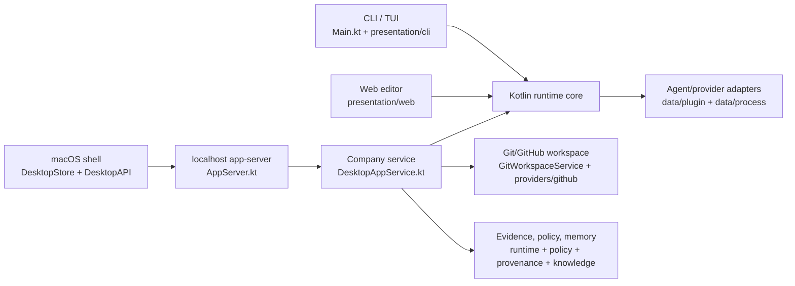
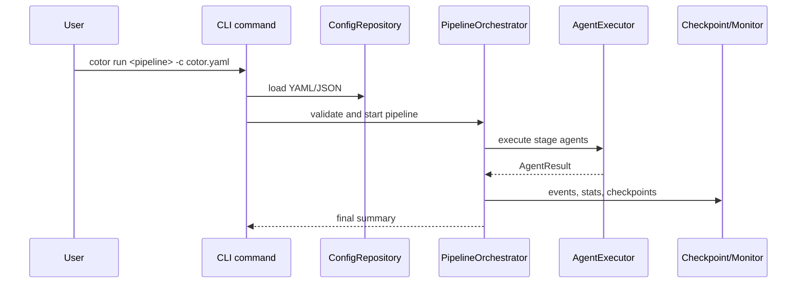
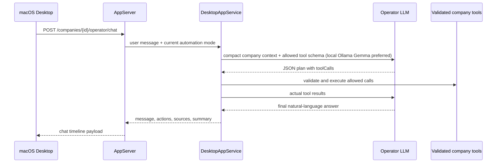
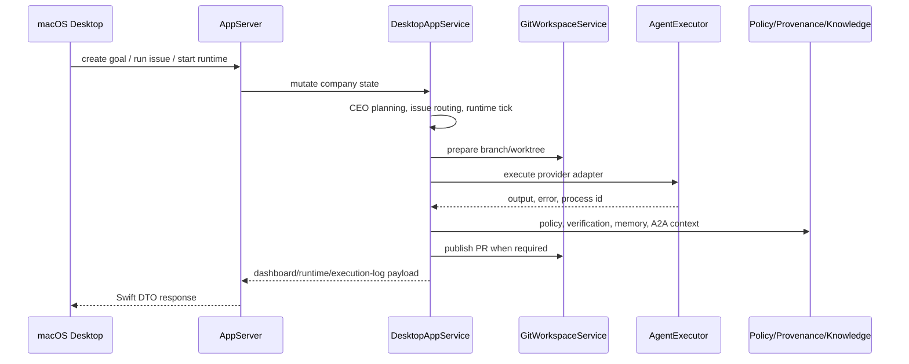

# Cotor Architecture

Cotor is a local-first multi-agent runtime. One Kotlin core powers three user surfaces:

- CLI/TUI commands
- a localhost `app-server`
- the native macOS desktop shell

The current product model is company-first in the desktop layer: a `Company` owns goals, issues, review state, runtime status, agent definitions, memory, and local evidence. Repositories, workspaces, tasks, and runs are execution infrastructure underneath that company boundary.

## 1. High-Level Runtime

## 2. Source Boundaries

| Boundary | Responsibility | Primary files |
| --- | --- | --- |
| CLI | command parsing, interactive/TUI launch, packaged lifecycle commands | `src/main/kotlin/com/cotor/Main.kt`, `src/main/kotlin/com/cotor/presentation/cli/` |
| App server | local HTTP API and desktop contract | `src/main/kotlin/com/cotor/app/AppServer.kt`, `src/main/kotlin/com/cotor/app/DesktopModels.kt` |
| Company workflow | company state machine, goals, issues, review queue, runtime ticks, runtime retention, reports, operator chat | `src/main/kotlin/com/cotor/app/DesktopAppService.kt`, `src/main/kotlin/com/cotor/app/CompanyRuntimeRetention.kt`, `src/main/kotlin/com/cotor/app/runtime/` |
| Pipeline runtime | generic pipeline planning, orchestration, execution, deterministic guards, stuck/conflict detection, aggregation, condition evaluation | `src/main/kotlin/com/cotor/domain/` |
| Agent/tool execution | provider plugins, local process execution, model defaults, command adapters | `src/main/kotlin/com/cotor/data/plugin/`, `src/main/kotlin/com/cotor/data/process/`, `src/main/kotlin/com/cotor/model/` |
| Context/memory/evidence | prompt context, durable snapshots, knowledge, provenance, verification bundles | `src/main/kotlin/com/cotor/context/`, `src/main/kotlin/com/cotor/runtime/`, `src/main/kotlin/com/cotor/knowledge/`, `src/main/kotlin/com/cotor/provenance/`, `src/main/kotlin/com/cotor/verification/` |
| Policy/security | action policy decisions, risk gates, executable/path validation | `src/main/kotlin/com/cotor/policy/`, `src/main/kotlin/com/cotor/security/` |
| External providers | GitHub control-plane state and optional Linear mirror | `src/main/kotlin/com/cotor/providers/github/`, `src/main/kotlin/com/cotor/integrations/linear/` |
| macOS desktop | SwiftUI shell, HTTP client, DTO decode, live projection | `macos/Sources/CotorDesktopApp/` |

## 3. Main Data Flow

### Generic pipeline run

### Operator chat

Operator chat is LLM-first for selected-company messages. The planner prefers local Ollama Gemma when a local Gemma-family model is discovered, then falls back to the selected company execution model. Keyword recognizers remain as compatibility helpers and concrete tool implementations, but they do not decide the primary user-facing answer.

### Desktop company run

## 4. Dependency Direction

- `presentation/*` and `app/AppServer.kt` are adapters. They may call application/domain services but should not own product state rules.
- `app/DesktopAppService.kt` is the company workflow coordinator. It may depend on domain runtime, provider adapters, policy, evidence, and stores.
- `domain/*` stays generic pipeline logic. It should not import desktop Swift concepts, app-server DTOs, or company UI state.
- `data/*` and `providers/*` wrap external processes, CLIs, local provider discovery, and GitHub state. They should not decide company product policy.
- `runtime/*`, `policy/*`, `provenance/*`, `knowledge/*`, and `verification/*` are shared support domains. They should expose explicit APIs rather than reaching into UI or route layers.
- `macos/Sources/CotorDesktopApp/*` consumes app-server DTOs through `DesktopAPI` and `DesktopStore`; it should not duplicate backend workflow decisions.

Avoid circular dependencies by keeping public entrypoints small and by passing typed snapshots or service interfaces across boundaries. If a change requires a lower-level module to call back into `app`, introduce a narrow interface or move the rule upward instead.

## 5. Public API Boundary

The app-server contract is the boundary between Kotlin and Swift. Additive payload fields are preferred. When changing a route response:

1. update Kotlin models in `DesktopModels.kt`
2. update route serialization in `AppServer.kt`
3. update Swift DTOs in `macos/Sources/CotorDesktopApp/Models.swift`
4. update `DesktopStore` and views that consume the field
5. add focused Kotlin and Swift decode/store tests

Important route groups live under `/api/app`: settings/backends, capabilities, providers, skills, browser, marketing, video, repositories, workspaces, tasks, runs, durable-runtime, policy, evidence, github, knowledge, verification, runtime, company, companies, issues, review-queue, and TUI sessions.

## 6. Company Workflow Invariants

The company automation layer has stricter invariants than the generic pipeline runner.

- Review queue items, QA issues, CEO approval issues, workflow tasks, and workflow runs are bound by explicit workflow lineage metadata for one PR review cycle.
- A newer execution publish must supersede the older review lineage atomically; stale QA or CEO verdicts may not flow into the new PR cycle.
- CEO planning is only treated as CEO decomposition when the run returns valid planning JSON. Invalid output is blocked with `CEO_PLANNING_INVALID_OUTPUT` or explicitly labeled as fallback planning where compatibility requires it.
- PR creation policy gates can be satisfied by an enabled CEO/chief approval authority; they should not become user-facing approval stops when internal authority exists.
- Direct execution completion requires verification and collaboration evidence where the issue policy requires it.
- Merge-conflict recovery and stale PR cleanup stay tied to the superseded lineage so the company can continue without stale review artifacts.
- No-diff code-producing runs retry once with explicit file-edit instructions and then block instead of claiming completion without changes.
- Runtime loop recoverable tick failures remain `RUNNING` with failure counters until the retry budget is exhausted; user stop/cancellation is interruption state, not a generic runtime error.
- Agent outputs pass through deterministic pipeline guards before downstream review state consumes them. Guard findings stay generic to the pipeline runtime and may annotate or block a stage without importing company UI concepts.
- Parallel pipeline execution uses conflict-safe batches when stage inputs indicate overlapping files or dependencies, so generic parallel mode does not knowingly launch two writers against the same target in one wave.

## 7. Autonomous Runtime v1

The v1 autonomous runtime is internal-quality focused.

- Memory is modeled as company/project/team/agent layers. `workflowMemory` remains a compatibility alias for project + team context.
- Issue-linked runs open A2A bridge metadata and inject `COTOR_A2A_*` environment variables.
- Discovery scans repeated failures, stale blocked work, review failures, verification gaps, runtime errors, stale follow-ups, and Graphify/repository structure warnings into `CompanyProblemSignal`.
- Runtime ticks synthesize CEO triage goals only from actionable, deduped, cooldown-safe problem signals. Otherwise they record observable idle states such as `idle-no-discovered-problems`.
- Local retention protects active/open/review/PR-linked worktrees and recent evidence while exposing dry-run cleanup for stale terminal worktrees, old orphan worktrees, and Cotor-recorded terminal processes.

## 8. Runtime Retention And Desktop Liveness

Long-running desktop sessions have two cleanup/liveness boundaries:

- Kotlin retention is owned by `CompanyRuntimeRetention`. It scans known `.cotor/worktrees` roots, classifies candidates, and only deletes when the caller explicitly sets `apply=true`; API and CLI dry-run are the default.
- The app-server exposes retention through `GET /api/app/runtime/cleanup/preview` and `POST /api/app/runtime/cleanup`. The CLI surface is `cotor company runtime cleanup`.
- macOS backend lifecycle is coordinated through `DesktopStore.bootstrap()` / `handleAppBecameActive()`. `EmbeddedBackendLauncher` remains a low-level process launcher.
- Company live updates use generation-scoped event-stream tasks. A malformed NDJSON line is logged and dropped per line; transport failure or cancellation ends the stream and allows reconnect/polling fallback.
- Meeting Room scene memory is company-scoped and capped with TTL/LRU pruning so animation ledgers do not leak across companies or grow without bound.

## 9. Graphify As Architecture Aid

Graphify output is tracked in `graphify-out/` and should be refreshed after source or documentation changes.

- Start with `graphify-out/GRAPH_REPORT.md` for corpus size, god nodes, and community shape.
- Use `graphify query`, `graphify path`, or `graphify explain` for narrow questions.
- Do not paste `graphify-out/graph.json` into docs or prompts.
- Run `graphify update .` after code/doc edits and `graphify cluster-only .` after larger boundary changes.

## 10. Module Docs

See [modules/README.md](modules/README.md) for concise module ownership, public entrypoints, test locations, and common change checklists.
